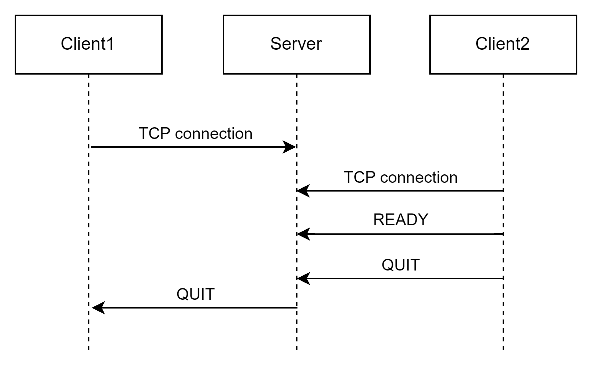

# Pongly protocol

### Section 1 - Overview

Pongly is a protocol designed for facilitating communication between clients and a server in a multiplayer Pong game. This protocol handles connection setup, paddle movement synchronization, scoring, and game session management.

### Section 2 - Transport protocol

The Pongly protocol is a pong multiplayer protocol. It must use the TCP (Transmission Control Protocol) to ensure the reliability of data transmission and must also use port 1313 by default.

The initial connection must be established by the client. The server can refuse the connection if the maximum number of connections is reached. The maximum number of connections per server is 10 by default. Beyond this number, connection can't be established.

Once the connection is established, if another client join the server, a game is started. During a game, client send is position to the server. If the client quit a party, he send a message to the server.

The server must verify that both clients of a party are connected. Server send the oponent position and the ball position to the player. Server compute the score and send it to the client. If a client is disconnected, the server send a message to the other client of the game and stop the game.

### Section 3 - Messages

The messages sent by the client and the server are text messages. The messages sent by the client are in the following form:

Message are always terminated by a '\n'

### Client side

#### Sending his own position

The client send its actual position

##### Request

position must be castable into integer

```
UPDATE_PLAYER;<position>
```

#### Say ready

The client send a message to specify that it's ready to start the game

##### Request

```
READY
```

#### Quit a game

The client can quit a game by sending a QUIT message to the server

##### Request

```
QUIT
```

### Server side

#### Sending computed position

The server send to the client, the actual position of the ball and the position of the adversary paddle.

##### Request

```
UPDATE_SERVER;<Paddle_y>;<Ball_x>;<Ball_y>
```

- `Paddle_y`: the paddle position, must be castable in int
- `Ball_x` : the x position of the ball
- `Ball_y` : the y position of the balle

#### Sending score to the client

The server send to the client, the actual score of the party.

##### Request

```
UPDATE_SCORE;<OpponnentScore>;<PlayerScore>
```

- `OpponentScore` : The score of the opponent
- `PlayerScore` : The score of the client

#### Quit message

When a client disconnect from a game, the second client of the game must be advertised. For that, the server can send a QUIT message.

##### Request

```
QUIT
```

### Section 4 - Examples

#### Functional communication between 2 clients and a server
In our implementation, communication is async. So, once the game is started, the client will send an UPDATE_PLAYER to the server, each time that is position is moved.

The server will send an UPDATE_SERVER each time that a new frame is computed (~10/s). The server will send an UPDATE_SCORE each time that the score change.


#### Client quitting the game before both ready



